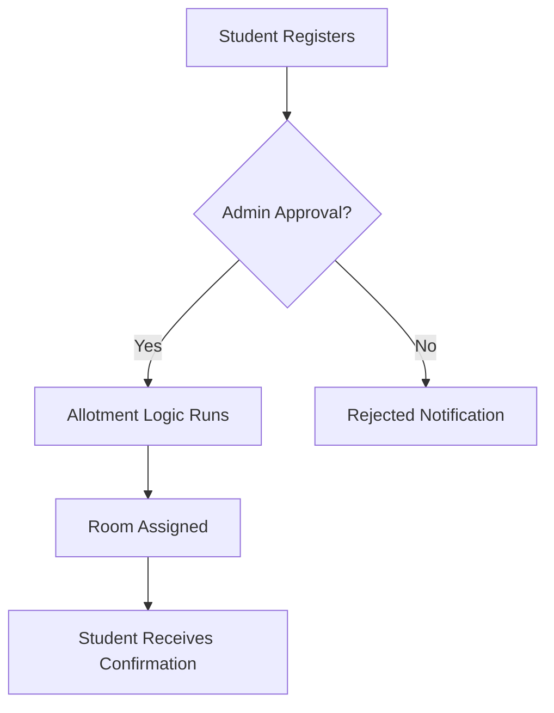

# 🏠 HostelNET

A **Virtual Hostel Allotment System** designed for universities to allocate hostel rooms fairly and transparently. Unlike first-come-first-serve models, HostelNET uses a **systematic and logic-driven approach** to ensure unbiased seat allotment for students.

---

## 🚀 Features

* 🎯 **Fair Allotment Logic** – eliminates bias and ensures transparent allocation.
* 👨‍🎓 **Student Portal** – easy hostel registration and status tracking.
* 🏢 **Admin Dashboard** – manage hostels, rooms, and student allotments.
* 🔐 **Role-based Access** – separate access levels for students and admins.
* 💳 *(Optional)* Payment Gateway integration for hostel fee submission.

---

## 🛠️ Tech Stack

* **Backend**: Django (Python)
* **Frontend**: HTML, CSS, JavaScript (with Bootstrap / Tailwind)
* **Database**: MySQL / PostgreSQL
* **Payment Gateway**: Razorpay (optional)
* **Deployment**: Docker / Heroku / AWS

---

## 📂 Project Structure

```
HostelNET/
│── hostelnet/        # Core Django project files
│── allotment/        # Hostel allocation logic
│── users/            # Authentication & roles
│── payments/         # Razorpay integration (if enabled)
│── templates/        # HTML files
│── static/           # CSS, JS, Images
│── requirements.txt  # Dependencies
│── manage.py
```

---

## ⚙️ Installation & Setup

1. **Clone the Repository**

   ```bash
   git clone https://github.com/your-username/HostelNET.git
   cd HostelNET
   ```

2. **Create Virtual Environment & Install Dependencies**

   ```bash
   python -m venv venv
   source venv/bin/activate   # On Windows use: venv\Scripts\activate
   pip install -r requirements.txt
   ```

3. **Apply Migrations**

   ```bash
   python manage.py migrate
   ```

4. **Create Superuser**

   ```bash
   python manage.py createsuperuser
   ```

5. **Run Development Server**

   ```bash
   python manage.py runserver
   ```

Now visit 👉 `http://127.0.0.1:8000/`

---

## 📊 Workflow Diagram



---

## 🧑‍💻 Contributing

Contributions are welcome!

* Fork the repo
* Create a feature branch
* Commit changes & open a PR

---

## 📜 License

This project is licensed under the **MIT License** – feel free to use and modify.

---

Made with ❤️ by Akshit Sahore
